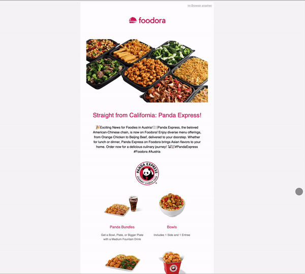

# Responsive Email Template

A beautiful and engaging email template that adapts perfectly to all devices.

This responsive email template ensures your Panda Express promotions and updates look stunning on any screen. It utilizes modern HTML and CSS techniques to guarantee optimal readability and user experience on desktops, tablets, and mobile phones.

[👆VEW EMAIL👆](https://hswinata.github.io/responsive_email_2/) 

## Features
   

1. **Responsive design**: Ensures optimal user experience on various devices and orientations.
2. **Clean and Concise Code**: Well-structured HTML and CSS code for easy customization and maintenance.
3. **Mobile-Optimized**: Optimized layout and styling for a smooth reading experience on smartphones.

## Technologies
1. **HTML/CSS**

## Style Features:

1. Media queries ensure optimal layout adjustments for various screen sizes and orientations.
2. Specific styles are defined for both landscape and portrait modes on mobile devices.
3. Font sizes and element spacing adapt dynamically for improved readability across devices.
4. Images adjust their width and height for a visually appealing presentation.
5. Mobile-specific elements can be shown or hidden based on the device.
